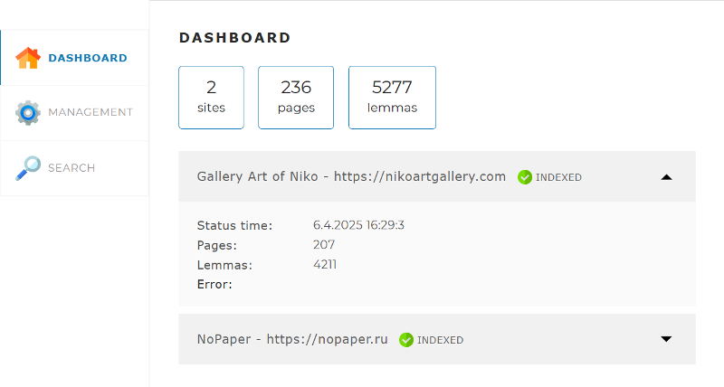
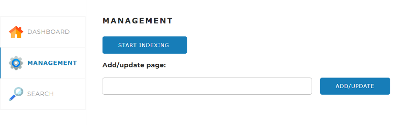
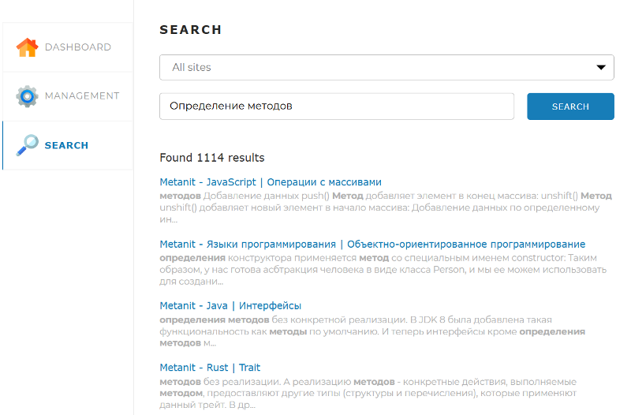

<a id="anchor"></a>
# SearchEngine
____
_Stack_:
Java 17, Spring Boot, Maven, MySQL, Hibernate,
Jsoup, Morphology Library Lucene, JDBC,
Lombok, Slf4j.
____

__SearchEngine__ - это поисковый движок, представляющий собой Spring-приложение, работающее с
локально установленной базой данных  
MySQL, имеющее простой веб-интерфейс и API, 
через который им можно управлять и получать результаты поисковой выдачи по запросу.

### Описание веб-интерфейса:

* __Dashboard.__ Эта вкладка открывается по умолчанию. На ней
  отображается общая статистика по всем сайтам,  
  а также детальная статистика и статус по каждому из сайтов (статистика, получаемая по
  запросу /api/statistics).
    * indexing - идёт индексация
    * indexed - индексация завершена без ошибок
    * failed - произошла ошибка



* __Management.__ На этой вкладке находятся инструменты управления
  поисковым движком — запуск и остановка полной индексации  
  (переиндексации), а также возможность добавить (обновить) отдельную
  страницу по ссылке  
  (по API-запросу /api/indexing и по API-запросу /api/indexPage):



* __Search.__ На этой вкладке находится поле поиска, выпадающий список с выбором
  сайта для поиска, а при нажатии на кнопку  
  «Найти» выводятся результаты поиска (по API-запросу /api/search):



Вся информация на вкладки подгружается путём запросов к API
приложения. При нажатии кнопок также отправляются запросы.

---

Принципы работы поискового движка и инструкция настройки работы:
1. В конфигурационном файле перед запуском приложения задаются
   адреса сайтов, по которым движок должен осуществлять поиск,  
   а так же логин и пароль локально установленной базы данных MySQL.
   
application.yaml
```yaml
server:
port: 8080

spring:
datasource:
url: jdbc:mysql://localhost:3306/search_engine?createDatabaseIfNotExist=true
username: логин
password: пароль
driver-class-name: com.mysql.cj.jdbc.Driver
```

```yaml
indexing-settings:
  sites:
    - url: https://www.playback.ru
      name: PlayBack.Ru
    - url: https://www.metanit.com
      name: Metanit
```

Так же необходимо указать токен для доступа к
Maven-репозиторию Morphology Library Lucene.  
Для указания токена найдите или создайте файл
settings.xml.

* В Windows он располагается в директории C:/Users/<Имя вашего пользователя>/.m2
* В Linux — в директории /home/<Имя вашего пользователя>/.m2
* В macOs — по адресу /Users/<Имя вашего пользователя>/.m2

Если файла settings.xml нет, создайте его и вставьте в него код:


```yaml
<settings xmlns="http://maven.apache.org/SETTINGS/1.0.0"
xmlns:xsi="http://www.w3.org/2001/XMLSchema-instance"
xsi:schemaLocation="http://maven.apache.org/SETTINGS/1.0.0
https://maven.apache.org/xsd/settings-1.0.0.xsd">

  <servers>
    <server>
      <id>skillbox-gitlab</id>
      <configuration>
        <httpHeaders>
          <property>
            <name>Private-Token</name>
            <value>wtb5axJDFX9Vm_W1Lexg</value>
          </property>
        </httpHeaders>
      </configuration>
    </server>
  </servers>
</settings>
```

Если файл уже есть, но в нём нет блока <servers>, то добавьте в него
только этот блок.  
Если этот блок в файле есть, добавьте внутрь него блок
<server> из фрагмента кода, приведённого выше.


В блоке <value> находится уникальный токен доступа. Если у вас возникнет
«401 Ошибка Авторизации»  
при попытке получения зависимостей, возьмите
актуальный токен доступа из документа по 
[ссылке](https://docs.google.com/document/d/1rb0ysFBLQltgLTvmh-ebaZfJSI7VwlFlEYT9V5_aPjc/edit?tab=t.0).  
Обязательно почистите кэш maven. Самый надёжный способ — удалить
директорию:
* Windows: C:\Users\\<Имя вашего пользователя>\\.m2\repository
* macOs: /Users/<Имя вашего пользователя>/.m2/repository
* Linux: /home/<Имя вашего пользователя>/.m2/repository


После этого снова попробуйте обновить данные из pom.xml.
Затем обновите зависимости в проекте при помощи <Ctrl+Shift+O>.


2. После получения контроллером запроса от пользователя по адресу "/api/indexing" поисковый движок самостоятельно 
   начинает  
   обходить все страницы заданных сайтов и индексировать их (создавать так называемый индекс), 
   чтобы потом находить наиболее  
   релевантные страницы по любому поисковому запросу.


3. Пользователь присылает запрос на поиск через "/api/search". Запрос состоит из набора
   слов, по которым нужно найти страницы сайта.
   
   
4. Запрос определённым образом трансформируется в список слов,
   переведённых в базовую форму. Например, для существительных   
   — именительный падеж, единственное число.


5. В индексе ищутся страницы, на которых встречаются все эти слова.


6. Результаты поиска ранжируются, сортируются и отдаются пользователю.

---

[вверх](#anchor)    